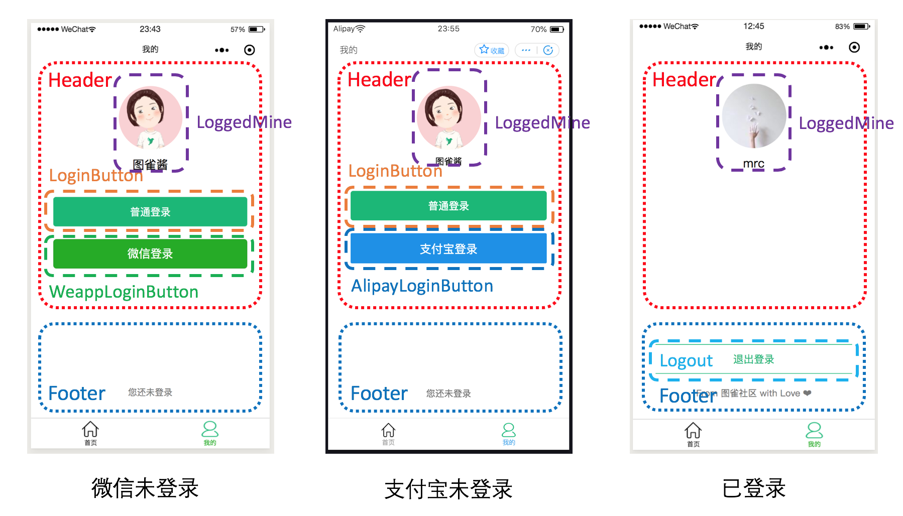

# Taro 多端小程序开发大型实战

【开发中】这里是《Taro 多端小程序开发大型实战》系列教程的源代码仓库。



## 体验项目

克隆本仓库，然后进入 ultra-club：

```bash
git clone https://github.com/tuture-dev/ultra-club.git
cd ultra-club
```

安装 npm 包：

```bash
npm install
# yarn
```

开启微信小程序开发服务器：

```bash
npm run dev:weapp
# yarn dev:weapp
```

开启支付宝小程序开发服务器：

```bash
npm run dev:alipay
# yarn dev:alipay
```

## 教程内容概要

- [上篇](https://juejin.im/post/5e046c4fe51d45584221e508)（已完成）
  - 用脚手架初始化项目
  - 用熟悉的 React 代码编写用户界面
  - 使用 React Hooks 重构状态管理
  - 用自带路由功能搭建多页面应用
- [中篇](https://juejin.im/post/5e0891b66fb9a0165936fb0b)（已完成）
  - 用 Taro UI 组件库升级界面
  - 实现多端登录（微信 + 支付宝 + 普通登录）
  - Hooks + Redux 彻底重构状态和数据流
- 下篇（✍️写作中）
  - 利用小程序云 Serverless 进行后台开发
  - 在小程序中接入后台数据
  - 多平台编译和发布

## 反馈

欢迎对此教程的内容进行反馈（无论是疑问还是改进意见），可以在文章下方留言，也可以在此仓库创建 Issue！

## 许可证

MIT。
