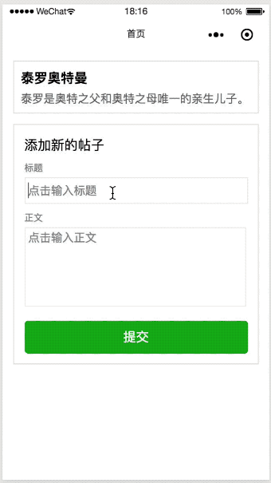

# 一杯茶的时间，上手 Taro 多端小程序开发

【开发中】这里是《一杯茶的时间，上手 Taro 多端小程序开发》源代码仓库。

## DEMO

上篇完成后的项目效果：

## 知识点规划

- 上篇
  - 用熟悉的 React 代码编写用户界面
  - 使用 React Hooks 重构状态管理
  - 用自带路由功能搭建多页面应用
- 下篇（✍️写作中）
  - 利用 [Taro UI](https://taro-ui.jd.com/#/) 组件库，让界面专业美观
  - 用 Redux 管理业务数据流
  - 利用小程序云进行后端开发
  - 编译为多端应用，并进行部署

## 反馈

欢迎对此教程的内容进行反馈（无论是疑问还是改进意见），可以在文章下方留言，也可以在此仓库创建 Issue！

## 许可证

MIT。
